# ASP.NET CORE 6.0 ile Portfolyo Projesi

Bu proje, **Acunmedya Akademi AkdemIQ Staj**'da aldığım "C# ile Programlama" eğitimi kapsamında verilen case olan bir ASP.NET CORE Portfolio sitesidir.  
Amacım, öğrendiğim **ASP.NET CORE Framework**, **Entity Framework** ve **MSSQL** gibi teknolojileri kullanarak dinamik veri yönetimi sağlayan kullanıcı dostu bir portföy sistemi oluşturmaktı.

## 🚀 Proje Özellikleri

- Dinamik içerik yönetimi (Hakkımda, Deneyimler, Beceriler, Referanslar)
- Kullanıcı dostu Admin Paneli
- Gelişmiş CRUD (Create, Read, Update, Delete) işlemleri
- Güçlü veritabanı yönetimi (Entity Framework & MSSQL Server)

## 🛠️ Kullanılan Teknolojiler

- **ASP.NET MVC Framework**
- **Entity Framework**
- **MSSQL Server**
- **LINQ Sorguları**

## 📷 Proje Görselleri

> Portfolyo Ana Sayfa  
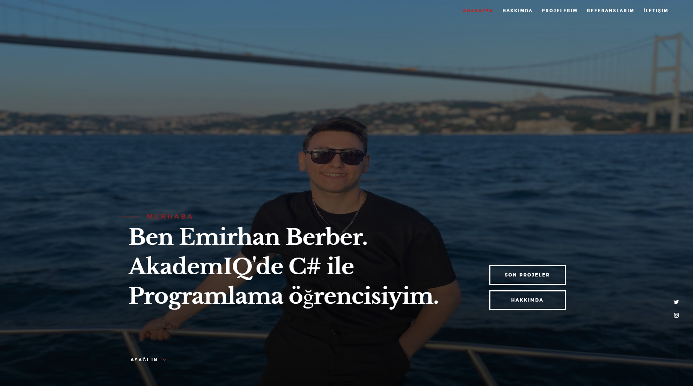
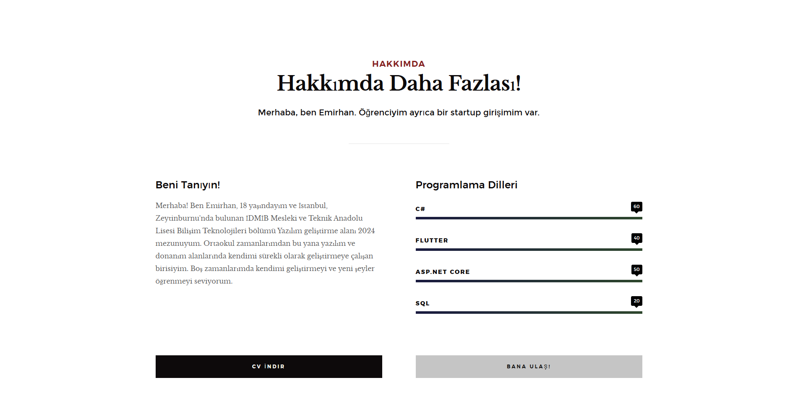
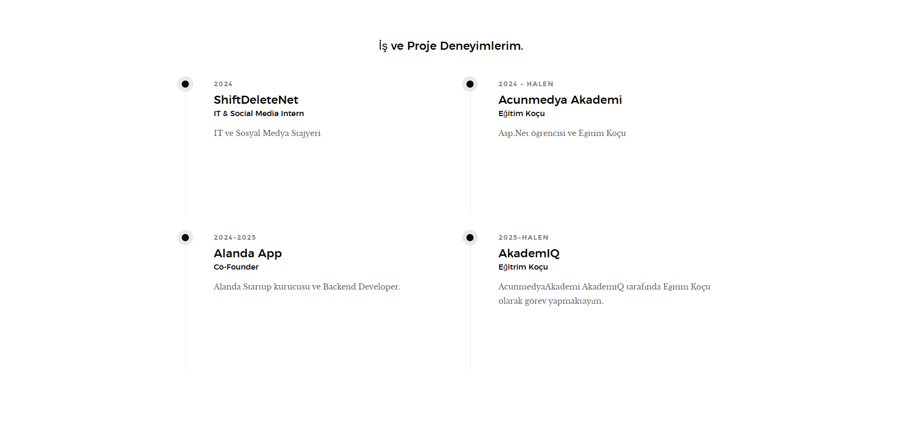
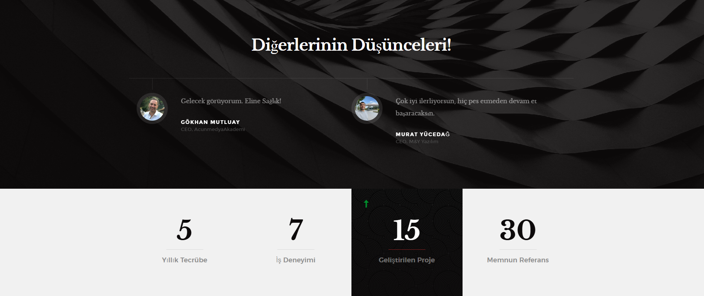
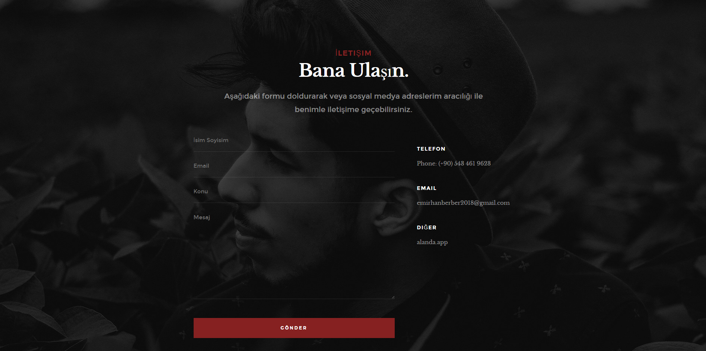


> Admin Paneli Yönetim Sayfası  
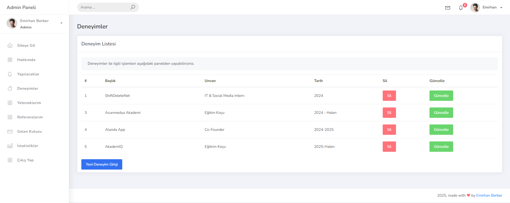
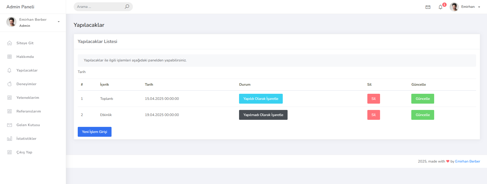
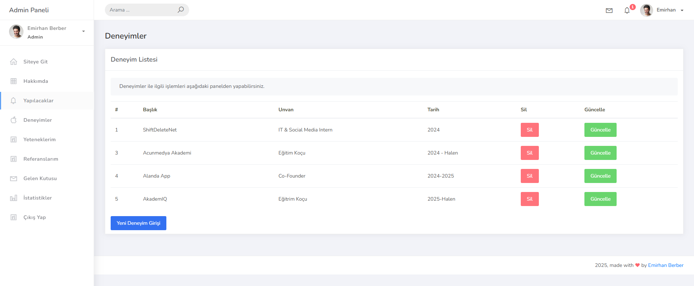
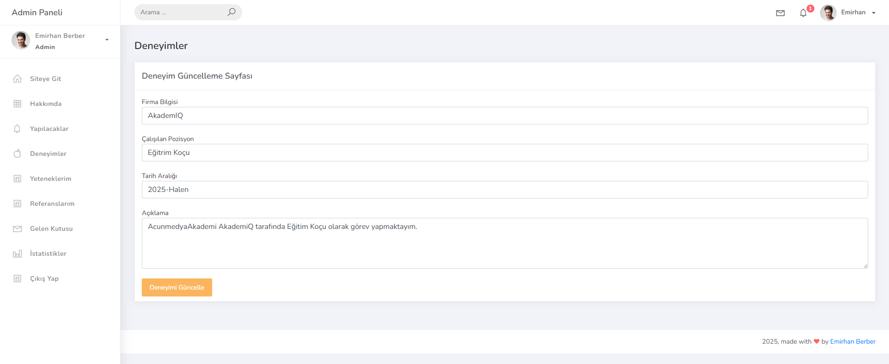
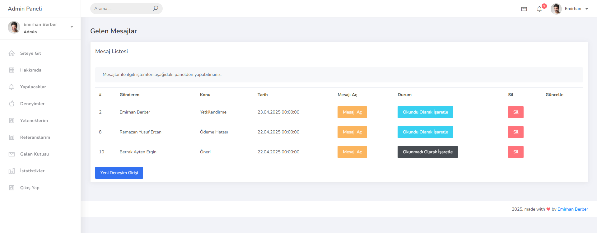
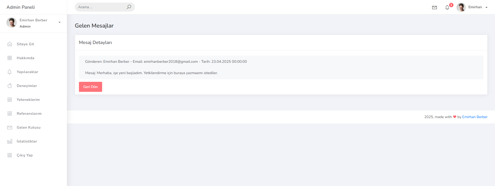

## 📂 Kurulum

Projeyi kendi bilgisayarınızda çalıştırmak için:  

```bash
1. Projeyi klonlayın:
   git clone https://github.com/emrhnberber/UdemyPortfolioCase.git

2. Visual Studio ile projeyi açın.

3. Gerekli NuGet paketlerini yükleyin.

4. Veritabanı bağlantı ayarlarını yapın (appsettings veya Web.config üzerinden).

5. Veritabanını oluşturun ve migration işlemlerini tamamlayın.

6. Projeyi çalıştırın!
